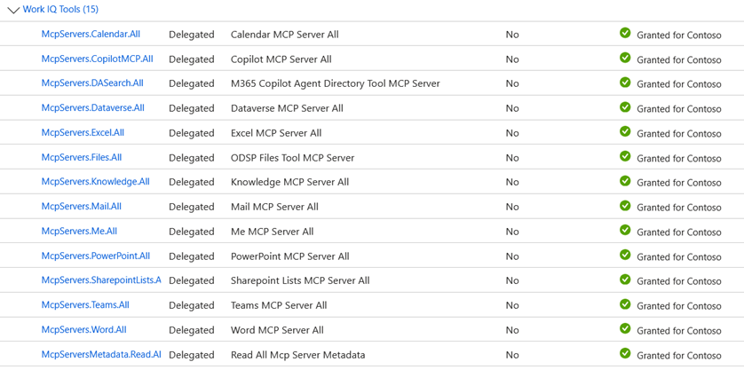
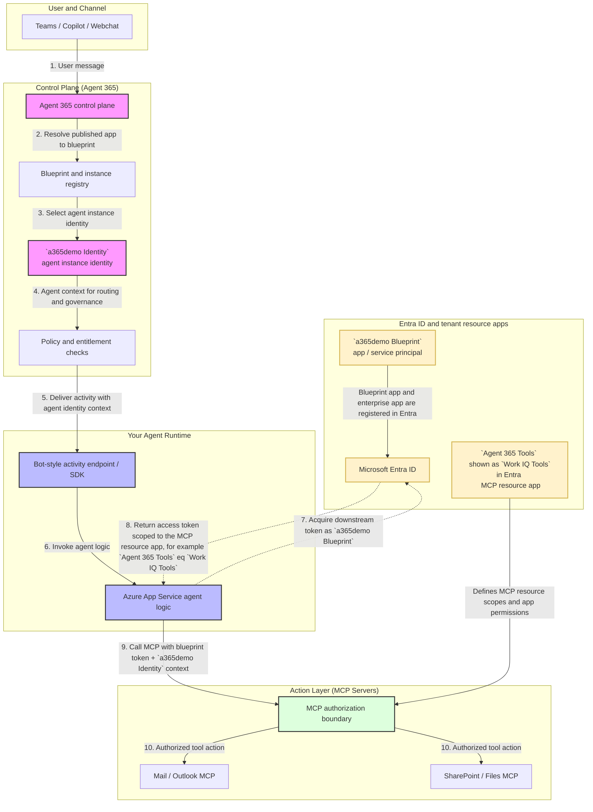

# Agent Extending with Agent 365

Built on the [Agent 365 + Microsoft Agent Framework sample](https://github.com/microsoft/Agent365-Samples).

## Features

- **Observability** — Tracing and monitoring via Agent 365 Observability SDK
- **MCP Tools** — Model Context Protocol server integration (Outlook, SharePoint, etc.)
- **Notifications** — Email and Word-comment notification handlers
- **Authentication** — Dual-mode:
  - **Anonymous / dev** — No auth; only Azure OpenAI credentials required
  - **Production** — Full agentic auth via `AUTH_HANDLER_NAME=AGENTIC`

## Screenshot

*Anonymous mode — LLM chat in Agents Playground (no Agent 365 needed)*


## Project Structure

```
main.py                 # Entry point
modules/
  agent.py              # Agent365Agent -- LLM + MCP + notifications
  host.py               # AgentHost -- aiohttp server, auth, typing indicator
  auth.py               # LocalAuthenticationOptions (dev/bearer token)
  token_cache.py        # Observability token cache
scripts/                # One-time tenant admin scripts
```

## Quick Start

> Docs: [Set up and run the Python Agent Framework sample agent](https://learn.microsoft.com/en-us/microsoft-agent-365/developer/quickstart-python-agent-framework)

```bash
# 1. Install (uv recommended; pip works too)
uv sync          # or: pip install -e .

# 2. Configure
cp .env.template .env   # fill in Azure OpenAI + auth values

# 3. Grant Azure OpenAI RBAC (required for Managed Identity / DefaultAzureCredential)
az role assignment create \
  --assignee "<your-user-or-managed-identity-object-id>" \
  --role "Cognitive Services OpenAI User" \
  --scope "/subscriptions/<sub>/resourceGroups/<rg>/providers/Microsoft.CognitiveServices/accounts/<account>"

# 4. Run
python main.py

# 5. Health check
curl http://localhost:3978/api/health
```

## Prerequisites for Agent 365

### 1. Enable Frontier features

Eligibility: Copilot license + Modern Billing + Frontier opt-in.

- **Admin Center** → Copilot → Settings → User Access → Copilot Frontier → turn on
- Accept Agent 365 T&C: Admin Center → Agents → Agent Overview → Try

### 2. Install the Agent 365 CLI

```powershell
dotnet tool install --global Microsoft.Agents.A365.DevTools.Cli
```
### 3. Create the Agent 365 Tools service principal (one-time, tenant admin)

Requires: **Application Administrator**, **Cloud Application Administrator**, or **Global Administrator** + `Application.ReadWrite.All` Graph scope.

```powershell
Set-ExecutionPolicy -Scope Process -ExecutionPolicy Bypass
.\scripts\New-Agent365ToolsServicePrincipalProdPublic.ps1
```

The script creates the tenant-wide enterprise application / service principal for the Agent 365 tooling resource app. In many tenants this appears as `Work IQ Tools`.
Check Microsoft Entra ID → Enterprise applications and search for `Work IQ Tools`.
Agent 365 Tools is the shared MCP resource app, and an A365 admin uses it to grant MCP permissions and consent to the `a365demo Blueprint`. It only needs to be created once per tenant.

### 4. Create your agentic identity and blueprint

Docs: [Agent blueprint and instance setup](https://learn.microsoft.com/en-us/microsoft-agent-365/developer/registration)

Requires: Global Admin + Azure Subscription Contributor/Owner; `Microsoft.Web` resource provider registered.

> [!TIP]
> See detailed insights into the actual API and commands by running `a365 setup all ` in [A365_CMD](./A365_CMD.md).

```powershell
a365 config init
a365 config display              # verify

a365 setup all                   # infra + blueprint + permissions
# Or step-by-step:
#   a365 setup infrastructure
#   a365 setup blueprint
#   a365 setup permissions mcp
#   a365 setup permissions bot

a365 config display -g           # verify final config
```

### Identity and service principals created or used in this flow

| Identity / app  | How it appears  | When it appears  | Why it exists |
|---|---|---|---|
| **Agent 365 Tools** resource app      | Often visible as `Work IQ Tools` in Enterprise applications              | Before MCP permissions can be granted. You create it once per tenant if it is not already present. | Shared MCP resource app used by an A365 admin to grant MCP permissions and consent to the blueprint                                        |
| **`a365demo Blueprint`**              | Bot-style app registration + enterprise application for the blueprint    | During `a365 setup blueprint` or `a365 setup all`                                                  | This is the blueprint definition for your agent. It is the object published in the manifest, later configured in Teams Developer Portal, and it carries the delegated API permissions, including `Work IQ Tools` / `Agent 365 Tools` delegated consent |
| **`a365demo Identity`**               | Agent identity / agent user template identity (`ServiceIdentity`) derived from the blueprint | After the blueprint exists and the agent identity is created as part of setup/onboarding           | This is the runtime agent user identity used for routing, bot auth, governance, and tool execution context for the actual agent instance   |
| **Microsoft 365 publish backend app** | Microsoft-owned first-party enterprise application                       | Only during `a365 publish`; not created by this repo                                               | Required for Microsoft 365 publish-side operations; if missing, publish can fail with `invalid_client`                                     |

- Agent 365 Tools → Created via `.\scripts\New-Agent365ToolsServicePrincipalProdPublic.ps1`
- `a365demo Blueprint` → Created by `a365` CLI
- `a365demo Identity` → Created by Agent 365 platform via `a365` setup flow
- Microsoft 365 publish backend app → Created by Microsoft 365 publish flow  

In short:  

- `Work IQ Tools` is the shared MCP resource app, and an A365 admin uses it to grant MCP permissions and consent to the blueprint.
- `a365demo Blueprint` is your tenant's bot-style blueprint app created by `a365 setup blueprint`, and it is the app that holds delegated API permissions such as `Work IQ Tools` delegated scopes.
- `a365demo Identity` is the runtime agent user / `ServiceIdentity` created from that blueprint and used by the running agent.

`a365demo` in this README is a sample, user-defined naming prefix from this repo's configuration. It is not a reserved Agent 365 platform name. You can replace it with a project-specific name in your own `a365.config.json`, and the generated blueprint, identity, UPN, and web app names will follow that choice.

So the usual order is: create or verify `Work IQ Tools` -> run `a365 setup blueprint` to create `a365demo Blueprint` -> create the agent identity (`a365demo Identity`) -> use Agent 365 Tools to grant MCP permissions and consent to the blueprint -> publish.

<p align="center">
   <a href="docs/a365demo-blueprint-api-permissions.png">
      
   </a>
</p>

<p align="center"><em>Example: the <b>blueprint</b> app carries delegated API permissions to Work IQ Tools.</em></p>

<details>
<summary>To verify they were created:</summary>

1. `Work IQ Tools`
  - Azure portal: Azure Portal -> Microsoft Entra ID -> Enterprise applications -> search for `Work IQ Tools`.
  - Reliable Entra page: `https://entra.microsoft.com/#view/Microsoft_AAD_IAM/StartboardApplicationsMenuBlade/~/AppAppsPreview`, then search by display name `Work IQ Tools`. If your tenant shows the consent name instead, also try `Agent 365 Tools`.
  - Config file: open `a365.generated.config.json` and confirm `resourceConsents` contains `"resourceName": "Agent 365 Tools"`.
  - CLI summary: run `a365 config display -g` and confirm MCP/resource consent entries are present.
1. `a365demo Blueprint`
  - Azure portal: Azure Portal -> Microsoft Entra ID -> App registrations or Enterprise applications -> search for `a365demo Blueprint`.
  - Reliable Entra app registrations page: `https://entra.microsoft.com/#view/Microsoft_AAD_RegisteredApps/ApplicationsListBlade`, then search by display name `a365demo Blueprint`.
  - Reliable Entra enterprise apps page: `https://entra.microsoft.com/#view/Microsoft_AAD_IAM/StartboardApplicationsMenuBlade/~/AppAppsPreview`, then search by display name `a365demo Blueprint`.
  - Note: object-detail deep links are less reliable than the list pages because Entra routes differently for app registrations, enterprise apps, and service identities.
  - Config file: open `a365.generated.config.json` and confirm `agentBlueprintId` is populated.
  - CLI summary: run `a365 config display -g` and confirm the blueprint/app ID is shown.
1. `a365demo Identity`
  - Azure portal: this is usually not as visible as a normal app registration. Start with Azure Portal -> Microsoft Entra ID -> Users, then search for the generated `agentUserPrincipalName` or the display name `a365demo Agent User`.
  - Reliable Entra users page: `https://entra.microsoft.com/#view/Microsoft_AAD_UsersAndTenants/UserManagementMenuBlade/~/AllUsers`, then search for the generated `agentUserPrincipalName`.
  - Note: this identity is an Entra `ServiceIdentity`, not a standard app registration. Depending on the tenant and portal experience, it may surface as a user-like object or an app-related object, so list-page search is more reliable than a direct object URL.
  - Config file: open `a365.generated.config.json` and confirm `AgenticAppId`, `AgenticUserId`, and `agentUserPrincipalName` are populated.
  - Microsoft 365 admin center: Agents -> All agents, then open your agent and review its identity details if available.
  - Setup result: if `a365 setup all` or the blueprint/permissions flow completed successfully, those generated identity values are the easiest non-portal proof that the identity exists.
</details>  

Related names that are easy to confuse:

- `a365demo Playground` is not an Entra object. It refers to the local **Agents Playground** testing tool/context used for local testing.
- `a365demo-**-webapp` is not an Entra identity object. It is the Azure **App Service** web app that hosts your agent runtime after `a365 deploy`.

### 5. Deploy to Azure App Service

M365 communicates with your agent via a public HTTPS endpoint.

```powershell
a365 deploy
```

### 6. Add MCP servers (optional)

Docs: [Add MCP servers to your agent](https://learn.microsoft.com/en-us/microsoft-agent-365/developer/testing)

```powershell
a365 develop list-available
a365 develop add-mcp-servers <serverName>
a365 develop list-configured
a365 setup permissions mcp
```

To use MCP servers with this agent in Microsoft 365:

1. Add the MCP server to your local `ToolingManifest.json` by using `a365 develop add-mcp-servers`.
2. Make sure `ToolingManifest.json` contains the MCP servers you want this runtime to expose. This repo already includes `mcp_MailTools` as an example.
3. Enable MCP in the runtime configuration:

   ```powershell
   # .env
   ENABLE_MCP=true
   ```

4. Apply the MCP scopes to the existing agent blueprint by running `a365 setup permissions mcp`. This reads `ToolingManifest.json` and grants the required MCP permissions to the blueprint. This step typically requires a Global Administrator.
5. For local development, you can run with bearer-token-based MCP access. For Microsoft 365 / deployed usage, use agentic auth (`USE_AGENTIC_AUTH=true` and `AUTH_HANDLER_NAME=AGENTIC`) so the hosted agent can call MCP tools with the configured agent identity.
6. Deploy and publish the agent. After the agent is available in Microsoft 365, users can invoke tool-backed actions in Teams or Microsoft 365 chat. On the first turn, this app loads the configured MCP servers and attaches them to the agent before handling the request.

<details>
<summary>Expand</summary>

#### Concrete example: use `mcp_MailTools`

1. Add the server to the local manifest:

   ```powershell
   a365 develop add-mcp-servers mcp_MailTools
   ```

2. Apply the required MCP permission to the blueprint:

   ```powershell
   a365 setup permissions mcp
   ```

3. Make sure `ToolingManifest.json` contains the server metadata. This repo now includes a working `mcp_MailTools`.

4. Enable MCP + agentic auth in `.env`:

   ```powershell
   ENABLE_MCP=true
   USE_AGENTIC_AUTH=true
   AUTH_HANDLER_NAME=AGENTIC
   ```

5. Deploy and publish the agent.

6. In Microsoft 365, ask the agent to perform a mail task, for example:
   - `Check my unread emails from today and summarize the top 5.`
   - `Draft a reply to the latest email from Alex, but ask me before sending.`

#### Concrete example: use `mcp_ExcelServer`

1. Add the server to the local manifest:

   ```powershell
   a365 develop add-mcp-servers mcp_ExcelServer
   ```

2. Apply the required MCP permission to the blueprint:

   ```powershell
   a365 setup permissions mcp
   ```

3. Add this server to `ToolingManifest.json` (or use `a365 develop add-mcp-servers mcp_ExcelServer` and then confirm with `a365 develop list-configured`):

4. Redeploy the app after updating the manifest and environment.

5. In Microsoft 365, ask the agent to perform an Excel task, for example:
   - `Open the sales workbook in OneDrive and summarize Q1 by region.`
   - `Find rows with negative margin in the current workbook and suggest a short summary.`

#### Optional tool-use instructions for the agent

If you want the model to be more explicit about when to use these tools, add guidance to the agent instructions / system prompt such as:

- `Use mcp_MailTools for email tasks such as reading, summarizing, drafting, or replying to mail.`
- `Use mcp_ExcelServer for workbook analysis, table inspection, spreadsheet summaries, and cell-based calculations.`
- `When a tool can change data, summarize the intended action and ask for confirmation before making the change.`
- `If the requested tool is unavailable or permission is missing, explain the limitation and continue without inventing results.`

</details>

### 7. Test with your agent

Docs: [Test your agent locally](https://learn.microsoft.com/en-us/microsoft-365/agents-sdk/test-with-toolkit-project)

You can use the `Microsoft Teams client` or `WebChat` to test the features that are not supported in the Microsoft 365 Agents playground.

**※ Caution**: **Agents Playground** is for local development only. Run the agent locally or remotely in Azure with non-auth configurations (`USE_AGENTIC_AUTH=false`, `AUTH_HANDLER_NAME=`) in anonymous mode.

```powershell
winget install agentsplayground   # or: npm install -g @microsoft/m365agentsplayground
agentsplayground
# pwsh ./scripts/Start-AgentsPlayground.ps1
```

### 8. After you test your agent locally, deploy it to Azure and publish it to Microsoft 365.

Docs:
- [Deploy agent to Azure App Service](https://learn.microsoft.com/en-us/microsoft-agent-365/developer/a365-dev-lifecycle)
- [Publish agent to Microsoft admin center](https://learn.microsoft.com/en-us/microsoft-agent-365/developer/publish)

```powershell
a365 deploy
a365 publish
```

Flow:
- Run `a365 deploy` to deploy the app to Azure App Service. Verify in Azure Portal → App Services → your web app that the site is deployed and running.
- Run `a365 publish` to update `manifest\manifest.json` and create `manifest\manifest.zip`.
- During or after `a365 publish`, follow the printed instructions and upload `manifest\manifest.zip` in the [Microsoft 365 admin center](https://admin.microsoft.com) under **Agents** → **All agents** → **Upload custom agent**.

## Resources

- [Agent 365 SDK — Python](https://github.com/microsoft/Agent365-python)
- [Agent 365 Samples](https://github.com/microsoft/Agent365-Samples)
- [Agent 365 CLI](https://github.com/microsoft/Agent365-devTools)
- [Agent 365 development lifecycle](https://learn.microsoft.com/en-us/microsoft-agent-365/developer/a365-dev-lifecycle)
- [Test agents by using the Microsoft Agent 365 SDK](https://learn.microsoft.com/en-us/microsoft-agent-365/developer/testing)
- [PyPI — microsoft-agents-a365](https://pypi.org/search/?q=microsoft-agents-a365)

## Architecture: Auth & Execution Flow



Agent 365 is built on the Bot Framework lineage and deploys as an **Azure App Service** exposing a bot-style HTTPS endpoint.

In this flow, the three important identity objects appear at different stages:

- `a365demo Blueprint` is created during setup, published in the app package, and later used by the runtime to acquire downstream app tokens from Entra. This is the bot-style app registration that carries delegated API permissions, including `Work IQ Tools` delegated scopes.
- `a365demo Identity` is the agent user / `ServiceIdentity` selected by the Agent 365 control plane, and that identity context is carried into routing, governance, and MCP execution.
- `Agent 365 Tools` (often shown as `Work IQ Tools` in Enterprise Applications) is the shared tenant MCP resource app. It is not the external caller itself; it is the resource/scope target used when the runtime requests tokens and when MCP-backed tool permissions are evaluated.

**Three auth layers:**

| Layer | Purpose | Proves |
|---|---|---|
| **Blueprint app / service principal** (Entra ID) | App registration, enterprise app presence, MSAL token acquisition, bot-style app identity, and delegated Microsoft 365 / `Work IQ Tools` API permissions | *"this blueprint app is allowed"* |
| **Agent identity** (A365 runtime identity derived from the blueprint) | Governance, routing, lifecycle, bot auth, and execution as the actual runtime agent user / service identity | *"this agent instance is allowed to do this"* |
| **MCP authorization boundary** | Per-tool access control for MCP servers such as Mail or Excel | Requires **both** the blueprint app permissions and the agent identity context |

Multi-channel: Teams, Copilot Studio, Webchat, and third-party channels.


